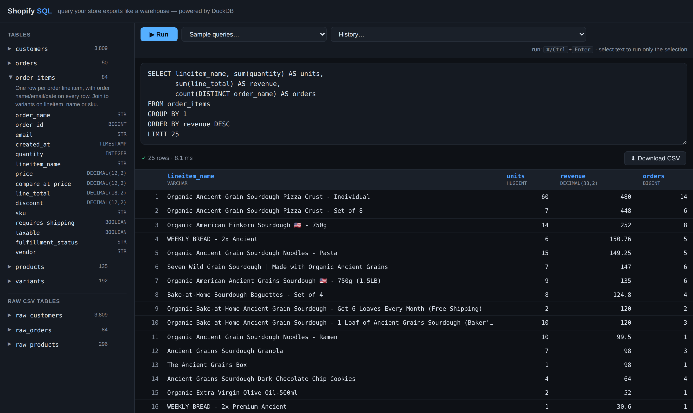

# Shopify SQL

A local SQL workbench for Shopify admin CSV exports. Drop your **customers**,
**orders**, and **products** exports in a folder and query them in the browser
with real SQL (DuckDB) — joins, aggregates, window functions — like a mini
BigQuery for your store.



## Quick start

```bash
pip install -r requirements.txt        # duckdb + pytz
# put your three Shopify exports into ./data (any filenames)
python app.py                          # opens http://127.0.0.1:8765
```

The three CSVs are recognized by their column headers, not their filenames, so
export from Shopify admin with whatever name it gives you:

| Export | Where in Shopify admin |
|---|---|
| Customers | Customers → Export |
| Orders | Orders → Export |
| Products | Products → Export |

> **Privacy note:** `data/*.csv` is gitignored on purpose — the exports contain
> customer names, emails, addresses, and phone numbers, and this repository is
> public. Never commit them.

## Tables

The raw CSVs are messy (apostrophe-prefixed IDs/zips/phones, one row per line
item, one row per variant, `yes/no` strings). On startup they're modeled into
clean, typed tables:

| Table | Grain | Notes |
|---|---|---|
| `customers` | one row per customer | `customer_id` as BIGINT, booleans for marketing opt-ins, `total_spent` DECIMAL, `zip`/`phone` cleaned |
| `orders` | one row per order | order-level fields + `line_count` / `total_quantity` aggregates; timestamps parsed (`created_at`, `paid_at`, `fulfilled_at`, `cancelled_at`) |
| `order_items` | one row per line item | order name / email / `created_at` on every row; `line_total = quantity × price` |
| `products` | one row per product | plus `variant_count`, `min_price`, `max_price`, metafields (`flavor`, `dietary_preferences`, …) |
| `variants` | one row per variant | includes a computed `lineitem_name` that matches `order_items.lineitem_name` |
| `raw_customers` / `raw_orders` / `raw_products` | CSV rows as-is | all VARCHAR, original Shopify headers — fallback if you need an unmodeled column |

Timestamps are kept in your **store's local time** (Shopify exports them that
way), so daily groupings match what you see in Shopify admin. A `shopify_ts()`
macro is available if you need to parse timestamp strings from the raw tables.

### How the tables join

```
customers.email      = orders.email  =  order_items.email
orders.order_name    = order_items.order_name
order_items.lineitem_name = variants.lineitem_name   (or sku = sku when present)
variants.handle      = products.handle
```

## Example queries

Top customers, joined to what they buy:

```sql
SELECT c.email, c.total_spent, oi.lineitem_name, sum(oi.quantity) AS units
FROM customers c
JOIN order_items oi USING (email)
WHERE c.total_spent > 1000
GROUP BY 1, 2, 3
ORDER BY c.total_spent DESC, units DESC;
```

Daily sales:

```sql
SELECT created_at::DATE AS day, count(*) AS orders,
       sum(total) AS revenue, round(avg(total), 2) AS aov
FROM orders
GROUP BY 1 ORDER BY 1 DESC;
```

Line items enriched with catalog cost and category:

```sql
SELECT oi.order_name, oi.quantity, oi.lineitem_name,
       v.cost_per_item, p.product_category
FROM order_items oi
LEFT JOIN variants v USING (lineitem_name)
LEFT JOIN products p ON p.handle = v.handle;
```

More samples are built into the UI ("Sample queries…" dropdown).

## UI tips

- **⌘/Ctrl + Enter** runs the query; select text first to run only the selection.
- Click a table in the sidebar to see its columns; click a column to insert it
  at the cursor; hover a table and hit **⏵ 100** to preview it.
- **Download CSV** exports the current result.
- Results are capped at 10,000 rows in the browser — aggregate or add a `LIMIT`
  for bigger sets.
- Query history (last 30) is kept in your browser's localStorage.

## Options

```bash
python app.py --data /path/to/exports   # different data folder
python app.py --port 9000               # different port
python app.py --no-browser              # don't auto-open a browser tab
```

Everything runs locally: the data is loaded into an in-memory DuckDB database
and the server binds to 127.0.0.1 — nothing leaves your machine. Restart the
app to pick up refreshed exports.
